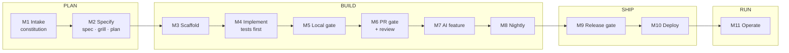

# 1. The big picture

## What we're building

**TicketDesk** is a multi-tenant support desk:

- Companies (**tenants**) sign up on their own. Their customers raise tickets; their staff work a shared queue.
- Each ticket has **SLA timers** (e.g. "first reply within 1 hour for P1"). Breaches are flagged and escalated.
- **AI** suggests a category and priority for new tickets, and drafts replies from the tenant's help articles. A human always decides.
- It is deliberately **self-contained**: no email, no third-party services except the AI gateway. Fewer moving parts, more time on the process.

Stack: **FastAPI** (Python) · **PostgreSQL** · **Next.js** (React) · deployed to **Azure Container Apps**.

## What you're really learning

Not "how to write a ticketing app". You're learning **how a team builds production software when AI agents write most of the code**, following the Deccansoft SDLC standard.

When agents write code, typing stops being the slow part. Three new problems take its place:

| Problem | Why agents make it worse | How the course handles it |
|---|---|---|
| **Intent** | An agent builds exactly what it's told, quickly and confidently | Write requirements down (constitution, specs) and *grill* them before any code |
| **Verification** | Agents produce more code than people can read line by line | Machines check most of it: tests first, hooks, CI gates, review agents |
| **Accountability** | An agent can be confidently wrong | Humans approve plans, merges and releases; agents never merge or deploy |

## How the course is organised

One module per SDLC phase. You build TicketDesk step by step; each module ends with a git tag (`m01-done`, …) so you can catch up.

Every module has the same three parts:

- **`notes.md`**: the concepts (about 15 minutes).
- **`lab.md`**: what you do, including the exact prompts to give the agent.
- **a tag**: the finished state, so you can compare against it or start from it.

## Two builders, one set of rules

You'll use **two coding agents**, and they're interchangeable:

| Agent | Where it runs | Good at |
|---|---|---|
| **Claude Code** | Terminal (and IDE extensions) | Long, multi-step tasks; running tests and fixing failures |
| **GitHub Copilot** (Agent mode) | VS Code chat | Pair-style work inside the editor |

Both read the **same instructions** and get the **same skills and guardrails** (page 2 explains how). The course often has you build with one and review with the other: two independent pairs of eyes.

## The hats you'll wear

The standard has six roles. In this course you play all of them, and each lab tells you which one you're wearing:

> 🎩 **Tech Lead hat:** you are now approving, not writing.

| Role | What they do |
|---|---|
| Product Owner | Decides *what* to build; writes and accepts requirements |
| Tech Lead | Designs; approves plans and high-risk changes |
| Developer | Directs agents; **owns every line they merge** |
| QA | Writes acceptance tests; signs off releases |
| Release Manager | Approves production; rolls back |
| Platform Owner | Owns the shared templates, gates and agent configuration |

Next: [2. Agent building blocks](02-agent-building-blocks.md)
