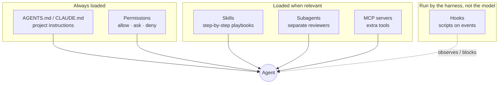

# 2. Agent building blocks

A coding agent (Claude Code, Copilot) is a language model in a loop: it reads files, runs commands, edits code and checks the result, until the task is done. Out of the box it knows how to program, but **nothing about your team**: your rules, your templates, your way of working.

You teach it through a handful of **extension points**. Each one is a file or folder in the repo, so it's versioned and reviewed like code.



## The building blocks

| Block | What it is | Where it lives | Claude Code | Copilot |
|---|---|---|---|---|
| **Instructions** | Plain-language facts and rules the agent reads at the start of every session | `AGENTS.md` (open convention), `CLAUDE.md` | `CLAUDE.md` (which imports `AGENTS.md`) | `AGENTS.md`, `.github/copilot-instructions.md` |
| **Skill** | A folder with a `SKILL.md` playbook: *how* to do one kind of task, step by step | `<harness>/skills/<name>/SKILL.md` | `.claude/skills/` | `.agents/skills/` |
| **Subagent** | A separate agent with its own instructions, tools and a **fresh context**, called for one job | one `.md` file per agent | `.claude/agents/` or a plugin | `.github/agents/*.agent.md` |
| **Hook** | A script the **harness** runs on an event (before or after a tool call). It can log or **block**. The model can't skip it | settings / plugin / hook file | `.claude/settings.json` or a plugin | `.github/hooks/*.json` |
| **Plugin** | A **package** of skills, subagents, hooks (and more), installed in one go from a **marketplace** (a git repo with a catalogue) | `.claude-plugin/` in the source repo | ✅ | — (we use files instead) |
| **MCP server** | A small server that gives the agent extra tools (a browser, a database, an API) through the Model Context Protocol | configured per harness | ✅ | ✅ |
| **Permissions** | Lists that decide which actions run freely, need your OK, or are forbidden | `.claude/settings.json`, `.vscode/settings.json` | allow / ask / deny | terminal auto-approve rules |

### Instructions: `AGENTS.md`

The cheapest and most important block. It tells every agent *what this project is* and *where things go*: "use `tenant_session()` for tenant data", "routers never import SQLAlchemy", "don't build email features". Keep it short and factual. Rules that must *always* hold don't belong here alone; they belong in a gate (see below).

### Skills: playbooks the agent pulls in when needed

A skill is just a folder:

```
.claude/skills/grill/
└── SKILL.md      ← YAML header (name, description) + the playbook
```

The agent always sees each skill's **name and one-line description**. It reads the full playbook only when the task matches, or when you call it directly: `/grill`. That keeps the context small while giving the agent dozens of reusable procedures.

Skills follow an open format (the Agent Skills spec), so **the same `SKILL.md` works in Claude Code and Copilot**. That's why we can share one set across both builders.

### Subagents: a second opinion with a clean slate

When an agent reviews its own work, it tends to agree with itself. A **subagent** starts with a **fresh context**: it sees only the diff and the docs you point it at, and it's given read-only tools. We use two: `code-reviewer` and `security-reviewer`.

### Hooks: rules the model can't talk its way around

Instructions are *requests*. Hooks are *enforcement*: the harness runs them, not the model. We use two:

- **Audit hook:** writes one line per tool call to `.agents/audit/audit.jsonl` (secrets redacted). You can always see what an agent did.
- **Scope guard:** while a task is active, **blocks** edits to files outside the task's approved list.

### Permissions: allow, ask, deny

| List | Meaning | Examples in our setup |
|---|---|---|
| **allow** | Runs without asking | `git status`, `uv run pytest` |
| **ask** | You confirm each time | `git push`, editing `docs/constitution.md`, migrations, auth code |
| **deny** | Never, whatever the prompt says | `git push --force`, `az …`, reading `.env`, editing CI workflows |

> **Instructions guide; gates enforce.** The most important idea in the course. If a rule must *always* hold, it can't live only in `AGENTS.md`. It needs a hook, a permission rule, a test, a CI check or a branch rule.

### Plugins and marketplaces

Copying ten files into every repo by hand doesn't scale. A **plugin** bundles skills, subagents and hooks into one installable unit. A **marketplace** is a git repo that lists plugins. Our org bundle repo *is* a marketplace with one plugin, `deccansoft-org`. Page 3 shows how it's installed.

### MCP servers

MCP (Model Context Protocol) lets an agent use outside tools: a browser for end-to-end testing, a database client. Each server is a supply-chain risk, so the org keeps an **allow-list** (`.agents/mcp-allowlist.yml`). Only listed servers, at pinned versions, may be used.

## Where each block comes from

You don't write most of these yourself. They arrive from two shared org repos, at pinned versions:

| Block | Comes from |
|---|---|
| Org rules, skills, subagents, hooks | **`agent-bundle`** (page 4) |
| `AGENTS.md` skeleton, permissions, CODEOWNERS, git hooks, CI | **`project-scaffold`** (page 5) |
| Project facts in `AGENTS.md`, specs, code | **your project** |

Next: [3. How extensions get installed](03-installing-extensions.md)
