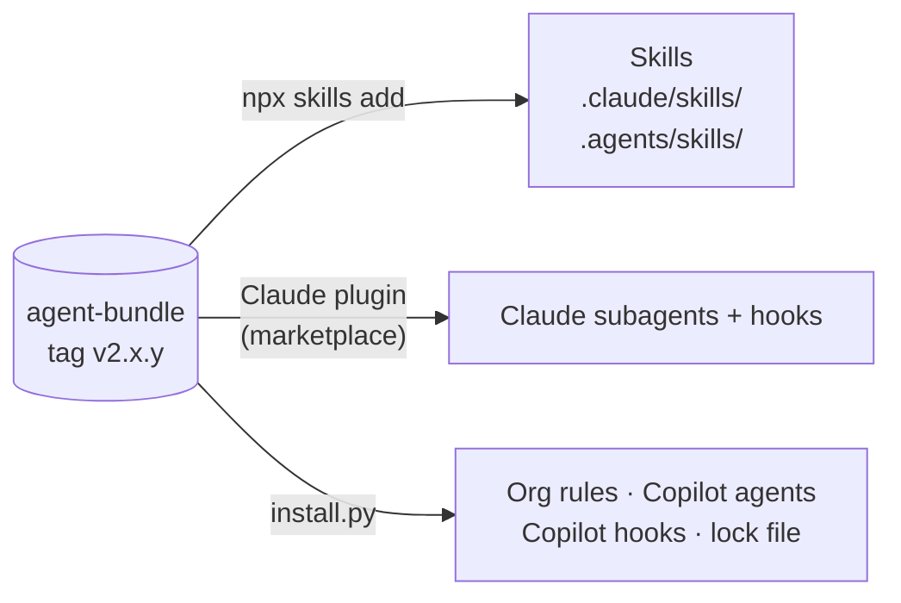

# 3. How extensions get installed

The org bundle (`DeccansoftAITeam/agent-bundle`) holds all our shared skills, subagents and hooks. Getting them into a project takes **three routes**, because each harness accepts different kinds of package. In the labs one script, `bootstrap.py`, runs all of this for you, but you should know what it does.



## Route 1: `npx skills` (skills, both harnesses)

**`npx`** comes with Node.js. It downloads a command-line tool and runs it **without a global install**. **`skills`** is an open-source CLI (from Vercel Labs) that installs Agent Skills into many different agents.

```sh
npx skills add DeccansoftAITeam/agent-bundle#v2.1.2 --skill '*' -a claude-code -a github-copilot --copy -y
```

| Part | Meaning |
|---|---|
| `DeccansoftAITeam/agent-bundle` | The GitHub repo to read skills from (it looks in `skills/` for `SKILL.md` files) |
| `#v2.1.2` | **Pin** to this tag. Without it you'd get whatever is on `main` today |
| `--skill '*'` | All skills in the repo |
| `-a claude-code -a github-copilot` | Install for both harnesses: `.claude/skills/` and `.agents/skills/` |
| `--copy` | Real copies, not symlinks (safer on Windows, and they get committed) |
| `-y` | Don't prompt |

It also writes **`skills-lock.json`**: which skill came from which repo, at which tag, with a content hash. Commit it. It's how a reviewer (or a CI check) sees exactly which version of each skill the project uses. `npx skills list` shows what's installed; `npx skills update` pulls newer versions.

> **Why pin?** A skill is an instruction the agent follows with your permissions. Installing "latest" would let a change in another repo silently change what your agent does. Pinned and reviewed in a PR, it's a deliberate upgrade.

## Route 2: the Claude Code plugin (subagents + hooks for Claude)

The bundle repo also contains a **marketplace** (`.claude-plugin/marketplace.json`) listing one **plugin**, `deccansoft-org`. The plugin carries the two review subagents and the two hooks.

You don't run any install command. The project's `.claude/settings.json` already says:

```json
"extraKnownMarketplaces": { "deccansoft": { "source": { "source": "github", "repo": "DeccansoftAITeam/agent-bundle", "ref": "v2.1.2" } } },
"enabledPlugins": { "deccansoft-org@deccansoft": true }
```

So the first time you run `claude` in the repo, it asks to install the plugin. Accept, and check with `/plugin` and `/agents`.

## Route 3: `install.py` (everything else)

Some things neither `npx skills` nor a Claude plugin can deliver:

| File(s) | Why it needs this route |
|---|---|
| `.agents/org/org-rules.md` | Org rules both harnesses read (via `CLAUDE.md` and `AGENTS.md`) |
| `.github/agents/*.agent.md` | Copilot's version of the two review subagents |
| `.github/hooks/*.json` + `.agents/hooks/*.py` | Copilot's audit and scope-guard hooks |
| `.agents/mcp-allowlist.yml` | The approved MCP servers |
| `.agents/bundle.lock` | Which bundle version and commit was installed (for drift checks) |

`python install.py . --check` exits non-zero if any of those files no longer match the pinned bundle. A conformance check (M8) uses it to catch hand edits.

## What is *not* installed from the bundle

**Permission lists, CODEOWNERS, git hooks and CI workflows** come from the **project scaffold** (page 5), not from the bundle. They're the project's own guardrails, so they live in the repo and are protected by CODEOWNERS. A developer can uninstall a plugin; they can't quietly remove a reviewed file from `main`.

## Upgrading

The Platform Owner releases a new bundle tag (e.g. `v2.1.3`). A project upgrades **in a PR**: re-run the three routes with the new tag, and review the diff of skills, lock files and hooks. Nothing changes under your feet.

Next: [4. Our org agent bundle](04-our-agent-bundle.md)
