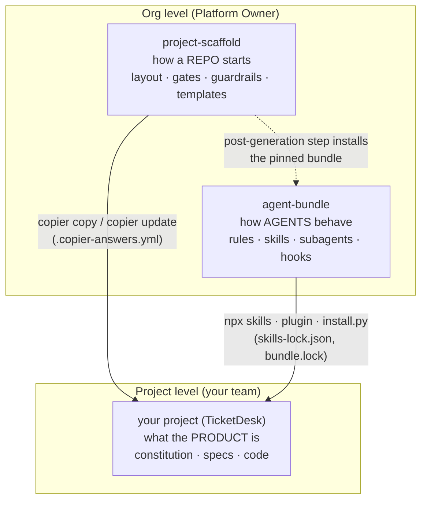

# 6. How the three repos fit together

| Repo | Answers | Changed by | How changes reach a project |
|---|---|---|---|
| **agent-bundle** | How do agents behave here? | Platform Owner, via PR + tag | Re-run the install with the new tag, in a project PR |
| **project-scaffold** | What does every repo start with? | Platform Owner, via PR + tag | `copier update` in a project PR |
| **your project** | What are we building? | Your team, via PRs | — |

## Who owns which file in your project

| Files | Owner | Change by |
|---|---|---|
| `.agents/**`, `.claude/skills/**`, `.github/agents/**`, `.github/hooks/**` | agent-bundle | Upgrading the bundle (never hand-edit) |
| `.claude/settings.json`, `.vscode/settings.json`, `.pre-commit-config.yaml`, `.github/workflows/**`, `CODEOWNERS` | project-scaffold | `copier update` (or a scaffold PR first) |
| `AGENTS.md` | Tech Lead (generated once, then project-owned) | Normal PR |
| `docs/constitution.md` | TL + PO | PR with both approvals |
| `docs/specs/**`, `docs/adr/**`, code | Team | Normal PR (high-risk paths need extra approval) |

## The version pins to look for

| File | Pins |
|---|---|
| `.copier-answers.yml` | Which scaffold version and which answers |
| `skills-lock.json` | Each skill's source repo, tag and content hash |
| `.agents/bundle.lock` | Bundle version and commit for the non-skill files |
| `.claude/settings.json` → `extraKnownMarketplaces…ref` | Which plugin version Claude installs |

If someone hand-edits a bundle-owned file, the pins no longer match and the conformance check (M8) fails. That's how "we all use the same agent setup" stays true without anyone policing it.

Next: [Glossary](glossary.md), then [M0 — Setup](../m00-setup/notes.md)
