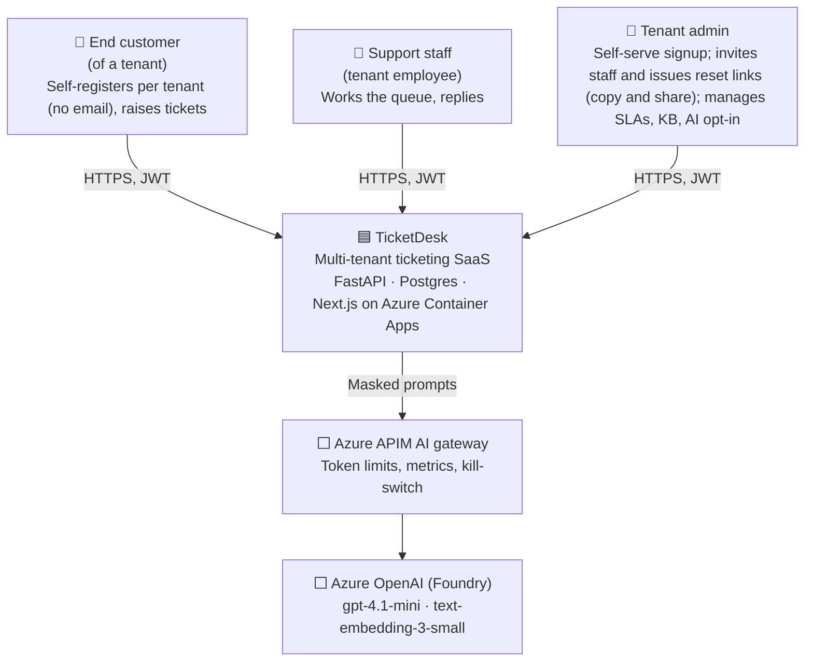

# TicketDesk — C4 Level 1: System Context

| Element | Responsibility | Trust |
|---|---|---|
| End customer | Creates tickets, reads replies, sees only their own tickets | Untrusted |
| Support staff | Sees all tickets of their tenant | Authenticated, tenant-scoped |
| Tenant admin | Configures their tenant | Authenticated, tenant-scoped, elevated |
| TicketDesk | All business logic; owns all data | Our system |
| APIM AI gateway | The only path to LLMs: quotas, logging, kill-switch | Ours (config) |
| Azure OpenAI | Model inference; no data retention for training | Third party (Microsoft) |

The only external system is the AI gateway (constitution amendment 2026-10-08).

The container view (C4 level 2) comes in M2 `design.md`.
