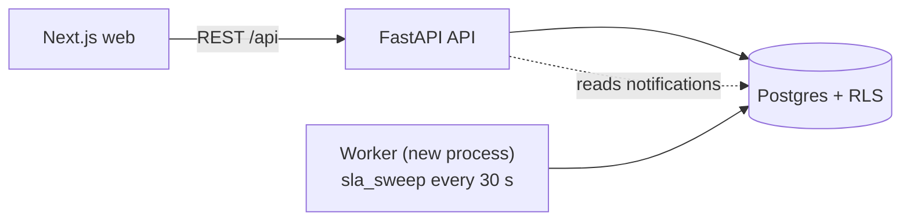

# Design: TD-007 Escalate ticket on SLA breach

| Field | Value |
|---|---|
| Spec | ./spec.md |
| Status | Draft (approval with `tasks.md`) |
| Author (human accountable) | DeccansoftAITeam |
| Drafted by agent? | Yes: Claude Code, Opus 5.5 (M1) |
| Approver | Tech Lead |

## 1. Summary

A **worker process** sweeps every 30 s. For each tenant with the flag on, inside a tenant-scoped transaction, it atomically sets breach timestamps on tickets whose deadline has passed, then writes audit entries and notifications **in the same transaction**. Idempotency comes from the `UPDATE … WHERE … IS NULL … RETURNING` pattern plus unique constraints. Deadlines are kept correct by TD-005's `compute_deadlines()`, which every clock-affecting event calls. The queue orders by a computed "breach-active" key.

## 2. Architecture delta (C4 level 2)



| Container | Change |
|---|---|
| API | Queue ordering by breach-active (AC-3); breach fields in the ticket DTO; notifications endpoint (TD-006) |
| **Worker** | **New** entry point `python -m app.workers.main` running `sla_sweep` every 30 s. In production it's the same image as the API, as a separate Container App with 1 replica |
| Web | Breach badge (AC-9); queue shows breach-active tickets first |

## 3. Data model & migration plan

| Change | Table/column | Type | Backward compatible? |
|---|---|---|---|
| Add | `tickets.first_response_breached_at` | `timestamptz NULL` | Yes |
| Add | `tickets.resolution_breached_at` | `timestamptz NULL` | Yes |
| Add | partial index `ix_tickets_sla_due` on `(tenant_id, first_response_due_at)` `WHERE first_response_breached_at IS NULL AND first_replied_at IS NULL` | index (concurrently) | Yes |
| Add | partial index `ix_tickets_res_due` on `(tenant_id, resolution_due_at)` `WHERE resolution_breached_at IS NULL AND status NOT IN ('resolved','pending_customer')` | index (concurrently) | Yes |
| Add | `notifications UNIQUE (tenant_id, user_id, kind, ticket_id, sla_type)` for breach kinds | constraint | Yes (new table from TD-006) |

`first_response_due_at`, `resolution_due_at`, `first_replied_at`, `paused_seconds` and the tenant schedule come from **TD-005**. This is an **expand-only** release: no contract step.

## 4. The sweep (core algorithm)

```text
every 30 s:
  if not pg_try_advisory_lock(hashtext('sla_sweep')): return      # one worker at a time
  for tenant in tenants_with_flag('sla-breach-escalation'):        # narrow, tested function
    begin; SET LOCAL app.tenant_id = tenant.id                     # RLS applies
      UPDATE tickets SET first_response_breached_at = now()
       WHERE first_response_breached_at IS NULL AND first_replied_at IS NULL
         AND first_response_due_at <= now()
       RETURNING id, assignee_id, first_response_due_at           # → AC-1
      UPDATE tickets SET resolution_breached_at = now()
       WHERE resolution_breached_at IS NULL
         AND status NOT IN ('resolved','pending_customer')
         AND resolution_due_at <= now()
       RETURNING id, assignee_id, resolution_due_at               # → AC-2, AC-10
      for each returned row:
        insert audit(ticket, sla_type, deadline, detected_at)     # → AC-6
        recipients = {assignee} ∪ admins(tenant) − {None}         # → AC-4, AC-5; set = dedupe (AC-7)
        insert notifications ... ON CONFLICT DO NOTHING           # → AC-7
    commit
  record sla_sweep_duration_seconds, sla_breaches_detected_total
```

Why it's idempotent (AC-7): a row can move from `NULL` to a timestamp only once; a concurrent sweep is blocked by the advisory lock, and the unique constraint covers it as well.

Why pausing works (AC-10): `pending_customer` is excluded, and TD-005 pushes `resolution_due_at` forward by the paused business time on resume.

## 5. Queue ordering (AC-3, AC-12)

```sql
breach_active_at = LEAST(
  CASE WHEN first_response_breached_at IS NOT NULL AND first_replied_at IS NULL THEN first_response_breached_at END,
  CASE WHEN resolution_breached_at   IS NOT NULL AND status <> 'resolved'      THEN resolution_breached_at END)
ORDER BY breach_active_at ASC NULLS LAST, <existing queue order>
```

## 6. API changes & versioning

| Endpoint | Change | Breaking? | Client impact |
|---|---|---|---|
| `GET /api/t/{slug}/tickets` | Ordering rule above; new fields `breach: {type, breached_at, active}` | No (additive) | Web: badge |
| `GET /api/t/{slug}/tickets/{id}` | Same new fields | No | Web |

## 7. Threat-model delta

| Threat id | Category | Mitigation | Verified by |
|---|---|---|---|
| TM-003 (existing) | Elevation | Sweep sets `app.tenant_id` per tenant; no bypass role | `test_td007_ac8_sweep_never_crosses_tenants` |
| TM-016 (new) | DoS | A huge tenant makes the sweep exceed 30 s, and breaches for everyone slip | Per-tenant batch limit (1000 rows per sweep), duration alert at 5 s, capacity test in M8 |

## 8. Decisions

| Decision | ADR |
|---|---|
| Tenant isolation in jobs via RLS loop | ADR-0003 |
| Periodic sweep vs scheduled messages | This design (grill Q3). Not cross-cutting, so no ADR |

## 9. Test plan (acceptance criteria → tests)

| AC | Layer | Test |
|---|---|---|
| AC-1, AC-2 | integration | `backend/tests/features/sla/test_sweep.py::test_td007_ac1_*`, `::test_td007_ac2_*` (frozen clock) |
| AC-3, AC-12 | API + E2E | `backend/tests/features/tickets/test_queue.py::test_td007_ac3_*`; `apps/web/e2e/queue.spec.ts "TD-007/AC-3"` |
| AC-4, AC-5, AC-7 | integration | `test_sweep.py::test_td007_ac4_*`, `ac5_*`, `ac7_concurrent_sweeps_single_notification`, `ac7_admin_assignee_once` |
| AC-6 | integration | `test_sweep.py::test_td007_ac6_audit_entry` |
| AC-8 | integration | `test_sweep.py::test_td007_ac8_sweep_never_crosses_tenants` |
| AC-9 | E2E + axe | `apps/web/e2e/queue.spec.ts "TD-007/AC-9"` |
| AC-10, AC-11, AC-13 | unit + integration | `backend/tests/features/sla/test_deadlines.py` (property-based, DST) + `test_sweep.py` |
| AC-14 | integration | `test_sweep.py::test_td007_ac14_flag_off_no_effect` |

## 10. Rollout & feature-flag plan

| Item | Plan |
|---|---|
| Flag key | `sla-breach-escalation`, per tenant, default **OFF** |
| Rollout | Demo tenant → all tenants after 1 week without alerts |
| Kill switch | Flag off: the sweep skips the tenant (breach timestamps already set stay set) |
| Flag removal | 2026-12-31 |

## 11. Observability

`sla_sweep_duration_seconds` (histogram), `sla_breaches_detected_total{sla_type}`, `sla_sweep_lock_skipped_total`; a span per tenant iteration with `tenant_id` (no PII). Alerts in M11.

## 12. Risks

| Risk | Likelihood | Impact | Mitigation |
|---|---|---|---|
| Clock skew between worker and DB | L | M | Use DB `now()` only, never app time |
| Worker down → no breaches | M | H | Container App health probe + "no sweep in 2 min" alert (M11) |
| DST bugs in deadlines | M | M | Property-based tests in TD-005 |

## 13. Approval

| Role | Name | Date |
|---|---|---|
| Tech Lead | | |
