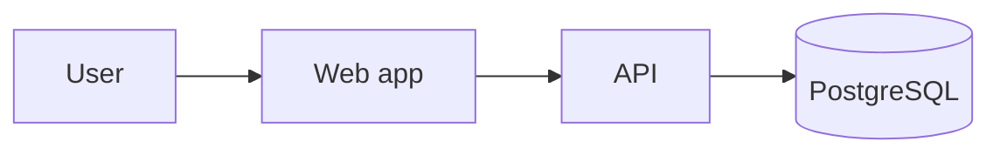

<!--
TEMPLATE: Feature Design  (standard_version 2.0.0)
Location: docs/specs/<SPEC-ID>-<slug>/design.md
Produced in: P1 Specify & Design, after spec.md is Approved.
Drafted by an agent (M1/M2), reviewed and approved by the Tech Lead.
Keep it to what changes. Link, don't copy, existing architecture docs.
-->

# Design: SPEC-<nnn> <Feature title>

| Field | Value |
|---|---|
| Spec | ./spec.md |
| Status | Draft / Approved |
| Author (human accountable) | <name> |
| Drafted by agent? | <yes: harness + model / no> |
| Approver | <Tech Lead> |

## 1. Summary

<!-- 3–5 sentences: approach chosen and why. -->

## 2. Architecture delta (C4)

<!-- Update docs/architecture/ diagrams-as-code in the same PR. Describe the delta here. -->
- Context changes: <new external system / user type / none>
- Container changes: <new deployable, queue, datastore / none>
- Component changes: <modules added or changed, by feature folder>

## 3. Data model & migration plan

| Change | Table/column | Type | Backward compatible? |
|---|---|---|---|
| <add column> | <orders.status_v2> | <enum> | <yes> |

Migration strategy (expand → migrate → contract):

| Step | Release | Action | Rollback |
|---|---|---|---|
| Expand | <vX.Y> | Add new nullable column / table / index CONCURRENTLY | Drop new object |
| Migrate | <vX.Y> | Code writes both; backfill in batches of <n> | Stop backfill |
| Contract | <vX.Y+1> | Remove old column after all readers moved | Restore from previous release |

- Lock-risk review (migration lint must pass): <notes>
- Data volume / backfill duration estimate: <n rows, t minutes>

## 4. API changes & versioning

| Endpoint | Change | Breaking? | Client impact (web / mobile / third party) |
|---|---|---|---|
| <POST /api/x> | <new optional field> | <no> | <regenerate client> |

- Breaking change? If yes: major API version bump, deprecation window <n weeks>, old mobile builds supported until <date>.
- Error responses use RFC 7807 Problem Details.
- Generated client regenerated and committed: required.

## 5. Threat-model delta

<!-- Required if change-risk tier is High or the feature touches auth, PII, payments, integrations, file upload, LLM/agents. Otherwise "Not applicable: <reason>". -->
- Updated section(s) in docs/security/threat-model.md: <links/anchors>
- New threats and mitigations (summary):

| Threat id | Category (STRIDE / LLMxx / ASIxx) | Mitigation | Verified by |
|---|---|---|---|
| | | | |

## 6. Decisions

| Decision | ADR |
|---|---|
| <decision> | <ADR-NNNN or "no ADR needed: reason"> |

## 7. Test plan (acceptance criteria → tests)

| AC ID | Test layer | Test location / name (must contain AC ID) | Owner |
|---|---|---|---|
| SPEC-<nnn>/AC-1 | unit | backend/tests/features/<f>/test_x.py::test_spec_nnn_ac1_... | Developer |
| SPEC-<nnn>/AC-2 | E2E | apps/web/e2e/<f>.spec.ts "SPEC-nnn/AC-2 ..." | QA |
| SPEC-<nnn>/AC-3 | eval | evals/<feature>/golden.yaml case tags | Dev + QA |

Non-functional tests: <load scenario, a11y flows, DAST scope, red-team scope>

## 8. Rollout & feature-flag plan

| Item | Plan |
|---|---|
| Flag key | `<flag-key>` (default OFF) |
| Rollout | internal → <n>% → 100% |
| Kill switch | flip flag off; expected effect: <...> |
| Flag removal | by <date>, tracked in issue <#> |
| Mobile | OTA via EAS Update? <yes/no — native change requires store release> |

## 9. Observability

- New spans / attributes: <names>
- New metrics: <name, type, labels>
- New logs (no PII): <events>
- Alerts + runbooks: <alert name → docs/runbooks/<file>.md>
- AI: Langfuse trace names, prompt ids, feedback capture: <...>

## 10. Risks & open points

| Risk | Likelihood | Impact | Mitigation |
|---|---|---|---|
| | | | |

## 11. Approval

| Role | Name | Date |
|---|---|---|
| Tech Lead | | |
