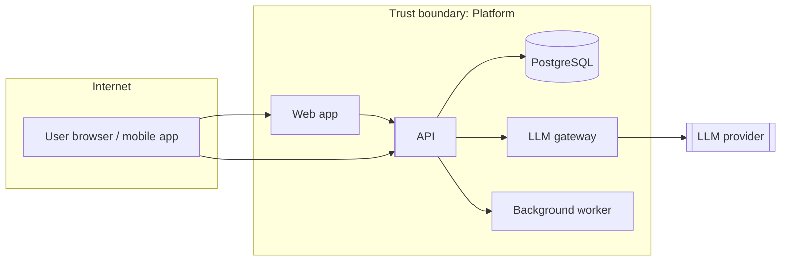

<!--
TEMPLATE: Threat Model  (standard_version 2.0.0)
Location: docs/security/threat-model.md (one living document per project; features add deltas).
When: project start (P0/P1) and for every High-risk change or any feature touching auth, PII, payments,
external integrations, file upload, or any LLM/agent capability.
How: a human-led 60–90 minute session (Tech Lead + rotating security reviewer + one developer; QA welcome).
An agent may draft sections beforehand; humans decide.
Four questions (Threat Modeling Manifesto):
  1. What are we working on?  2. What can go wrong?  3. What are we going to do about it?  4. Did we do a good enough job?
Threat IDs: TM-<nnn>. Optional adversarial-ML technique labels use MITRE ATLAS technique IDs (AML.Txxxx).
-->

# Threat Model — <Project Name>

| Field | Value |
|---|---|
| Version | <n> |
| Last session | <YYYY-MM-DD> |
| Participants | <names / roles> |
| Security reviewer | <name (rotating Tech Lead duty)> |
| ASVS level | <L1 / L2> |

## 1. What are we working on?

### 1.1 Scope

<!-- System or feature in scope for this session. -->

### 1.2 Data-flow diagram

### 1.3 Assets & trust boundaries

| Asset | Classification | Where stored / processed |
|---|---|---|
| <user PII> | Confidential | DB, logs (must be redacted), LLM prompts (must be masked) |

| Trust boundary | Between | Crossing controls |
|---|---|---|
| TB-1 | Internet ↔ API | TLS, authN, rate limit, input validation |

## 2. What can go wrong? (STRIDE per data flow / element)

| ID | Element / flow | STRIDE | Threat | Likelihood (L/M/H) | Impact (L/M/H) | Mitigation | Status | Verified by (test / gate) |
|---|---|---|---|---|---|---|---|---|
| TM-001 | U → A | Spoofing | Stolen session token reused | M | H | Short-lived tokens, rotation, device binding | Mitigated | test_auth_token_rotation |
| TM-002 | A → DB | Tampering | SQL injection via filter params | L | H | ORM only, no raw SQL with user input; semgrep rule | Mitigated | SAST gate |
| TM-003 | A | Repudiation | Admin action without audit trail | M | M | Append-only audit log | Open | <issue> |
| TM-004 | A → logs | Information disclosure | PII written to logs | M | H | Log redaction filter | Mitigated | test_log_redaction |
| TM-005 | A | Denial of service | Unbounded list endpoint | M | M | Pagination caps, rate limits | Mitigated | Schemathesis + k6 |
| TM-006 | A | Elevation of privilege | IDOR on /orders/{id} | M | H | Ownership check in service layer | Mitigated | test_orders_idor |

## 3. AI threats — OWASP Top 10 for LLM Applications (2025)

<!-- Complete for every LLM feature. Mark "N/A" with reason if a category truly cannot apply. -->

| Category | Applies? | Threat in this system | Mitigation | Verified by | ATLAS id (optional) |
|---|---|---|---|---|---|
| LLM01 Prompt Injection (direct & indirect via documents/tools) | | | Input scanner, instruction hierarchy, tool allow-list, no secrets in context | Red-team suite | |
| LLM02 Sensitive Information Disclosure | | | Masking before prompt, output PII scanner, permission-filtered retrieval | Eval: PII leakage = 0 | |
| LLM03 Supply Chain (models, plugins, datasets) | | | Pinned models via gateway, vetted packages, AI-BOM | Release gate | |
| LLM04 Data & Model Poisoning | | | Source ownership, ingestion validation, lineage | Ingestion tests | |
| LLM05 Improper Output Handling | | | Output parsed into schemas; never executed/rendered raw | Unit tests | |
| LLM06 Excessive Agency | | | Least-agency tools, HITL for irreversible actions, step/cost limits | Integration tests | |
| LLM07 System Prompt Leakage | | | No secrets in prompts; leakage probes | Red-team suite | |
| LLM08 Vector & Embedding Weaknesses | | | Tenant/ACL filter in query (RLS), embedding deletion path | test_rag_permissions | |
| LLM09 Misinformation | | | Grounding + citations, groundedness threshold | Eval gate | |
| LLM10 Unbounded Consumption | | | Gateway budgets, rate limits, max tokens | Gateway config + k6 | |

## 4. Agentic threats — OWASP Top 10 for Agentic Applications (2026)

<!-- Complete for any in-product agent AND review once per project for our coding-agent setup. -->

| Category | Applies? | Threat | Mitigation | Verified by |
|---|---|---|---|---|
| ASI01 Agent Goal Hijack | | | Untrusted-content isolation, goal restated per step, HITL on high-impact actions | |
| ASI02 Tool Misuse & Exploitation | | | Typed tool params, allow-list, validation before execution | |
| ASI03 Identity & Privilege Abuse | | | Per-agent identity, short-lived scoped credentials | |
| ASI04 Agentic Supply Chain (MCP servers, plugins, tool descriptions) | | | Pinned allow-listed MCP servers, MCP scanning on change | |
| ASI05 Unexpected Code Execution | | | Sandboxed execution, no shell tools in prod agents | |
| ASI06 Memory & Context Poisoning | | | Memory provenance, expiry, write validation | |
| ASI07 Insecure Inter-Agent Communication | | | Structured, authenticated messages; schema validation | |
| ASI08 Cascading Failures | | | Circuit breakers, step limits, retries with backoff | |
| ASI09 Human-Agent Trust Exploitation | | | Clear AI disclosure, confirmations show exact effect | |
| ASI10 Rogue Agents | | | Kill switch, action audit trail, anomaly alerts | |

## 5. Privacy threats — LINDDUN-lite

<!-- Required when processing personal data of EU or other regulated users. -->

| Category | Question | Finding | Mitigation |
|---|---|---|---|
| Linking | Can records be linked to build a profile? | | |
| Identifying | Can a person be identified from "anonymous" data? | | |
| Non-repudiation | Are users unable to deny actions they should be able to? | | |
| Detecting | Can someone infer a person is in the system? | | |
| Data disclosure | Is more data collected/shared than necessary? | | |
| Unawareness | Do users know what is collected and why (incl. AI use)? | | |
| Non-compliance | Retention, consent, deletion (incl. embeddings) honoured? | | |

## 6. What are we going to do about it? — Action list

| Threat ID | Action | Owner | Issue | Due |
|---|---|---|---|---|
| | | | | |

## 7. Did we do a good enough job?

- [ ] Every trust boundary has at least one threat considered
- [ ] Every High-impact threat is Mitigated or has an accepted-risk waiver
- [ ] Every mitigation has a "Verified by" test or gate
- [ ] AI/agentic sections completed for all LLM features
- [ ] Session retro notes: <what to improve next time>

## Change log

| Date | Version | Change | Session participants |
|---|---|---|---|
